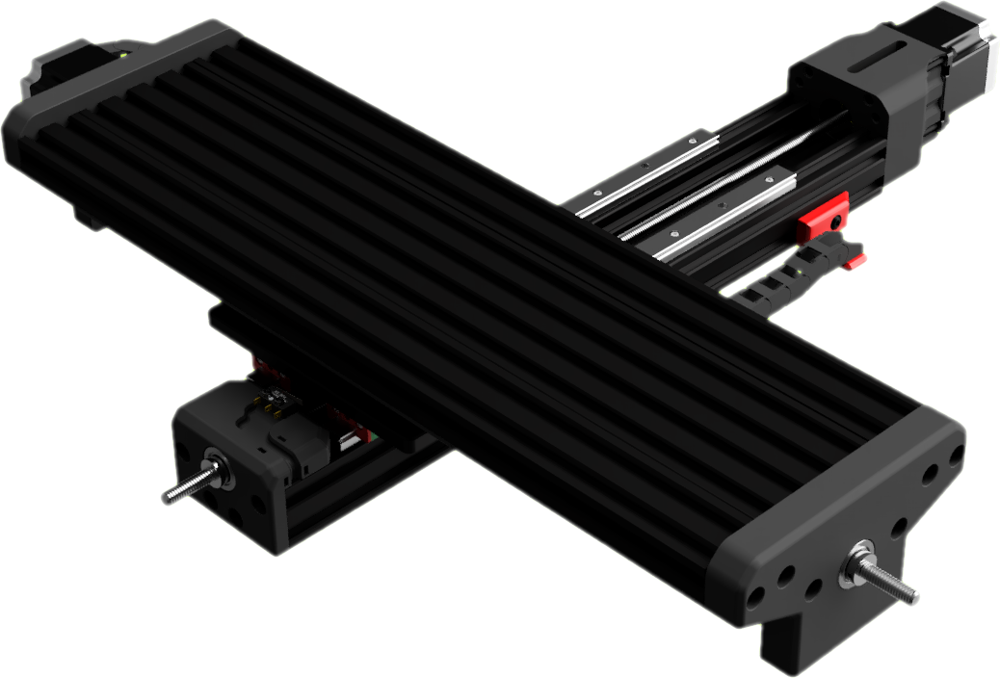
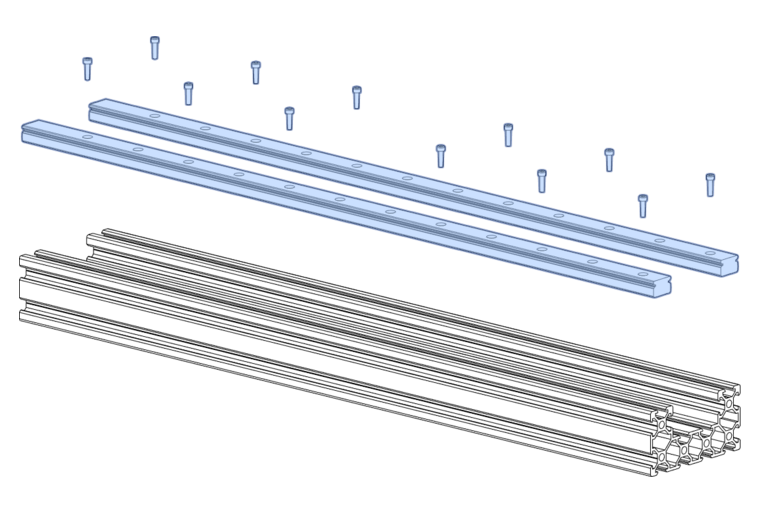
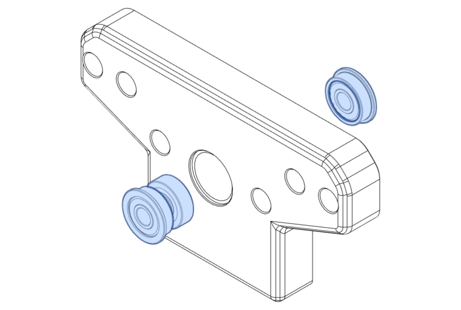
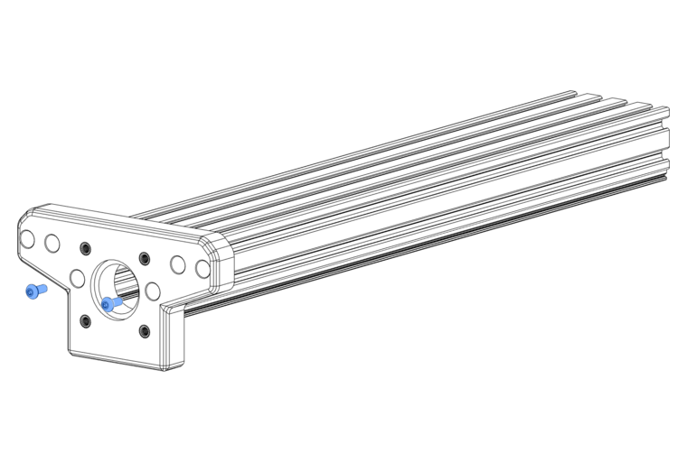
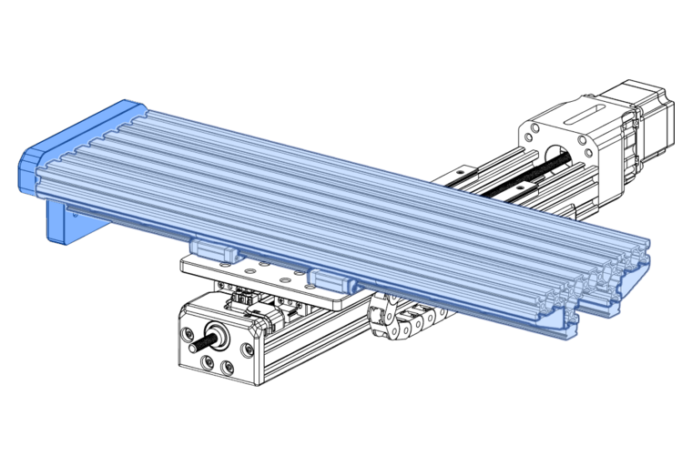
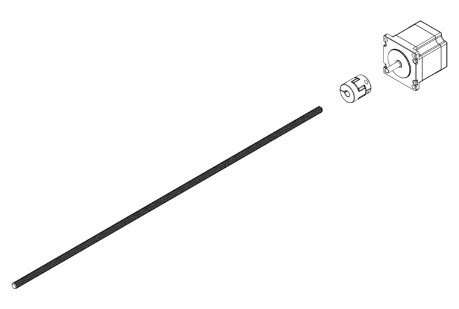
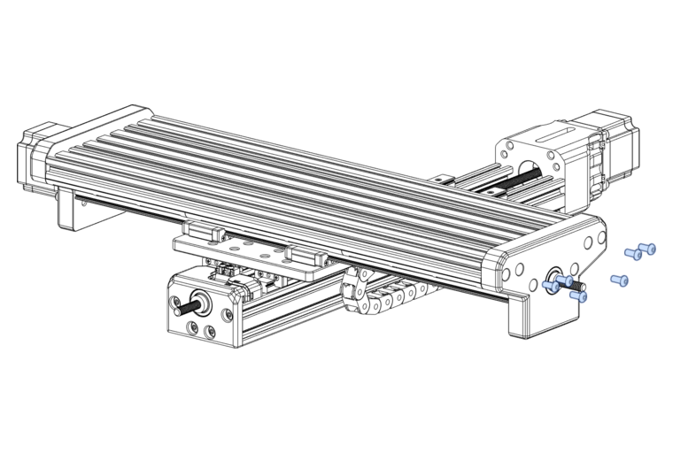

# X Axis Assembly



---
## Rails

```
M3x10mm SHCS
MGN15 500mm Rails
C-beam 500mm
```

Fasten the MGN15 500mm Rails to the 500mm extrusion by screwing M3x10mm SHCS into the spring t-nuts inside the profile.

{: .shadow}

---
## Bearing Block
```
F608ZZ bearing
608ZZ bearing
```

Insert a 608ZZ bearing in the outside  of the X axis bearing block, then insert a F608ZZ bearing on either side. The bearings must sit flush inside the bearing block on both sides.

!!! tip
    The 'F' in F608ZZ stands for 'flanged'. The flange on the 2 outer bearings allows
    them to be pushed into place flush within the bearing block. The flange provides axial
    force against the bearing block when the locking collars are tightened up.

{: .shadow}

---
## Motor Mount

```
M2.5 Heat Insert
M3 Heat Insert
M5 Heat Insert
```

Insert the M2.5, M3 and M5 heat-set inserts in the x axis motor mount. M2.5 inserts for the endstop switch mount, M3 inserts for the drag-chain mount, and M5 inserts to mount the motor.

{: .shadow}

---

```
M5x12mm BHCS
```

Fasten the X axis motor mount to the 500mm C-beam using 2 x M5x12mm BHCS.

{: .shadow}

---
```
M5x12mm BHCS
2080 500mm
```

Fasten the X axis motor mount to the 2 x 500mm 4020 extrusions using 4 x M5x12mm BHCS.

{: .shadow}

---

```
M5x12mm BHCS
```

Fasten the X axis table support to the spring t-nut in the 500mm C-beam using 18 x M5x12mm BHCS.

{: .shadow}

---
```
M5x8mm BHCS
```

Fasten the X axis table support to the spring t-nut in the 500mm 4020 extrusions using 18 x M5x8mm BHCS.

{: .shadow}

---

{: .shadow}

---

## X Motor

```
550mm leadscrew
8 to 6.35mm rigid coupler
```

Couple the NEMA23 motor to the 550mm leadscrew using a 8 to 6.35mm rigid coupler. Remember to use medium-strength thread-lock on the grub screws in the couplers!

<!-- This image is reused from the y axis assembly on purpose -->
{: .shadow}

---

{: .shadow}

---
```
M5x20mm SHCS
```

Fasten the NEMA23 motor to the X axis motor mount using M5x20mm SHCS.

{: .shadow}

---

Install both locking collars onto the leadscrew without tightening either at this point.

{: .shadow}

---

```
M5x12mm BHCS
```

Fasten the X axis bearing block to the 500mm C-beam and the 4020 extrusions using 6 x M5x12mm BHCS.

{: .shadow}

---

## Locking collar preload

Using your fingers, press each locking collar towards each other - driving them into the face of each bearing with moderate to high pressure. Tighten the inner collar first before tightening the external side collar. This will ensure that the screw remains in the same position during use.

!!! note
    Add some medium-strength thread-lock to the set screw.

{: .shadow}

---

## Drag chain orientation

Drag chains have 2 different sides - a fixed side and a free side. For this setup, the fixed side is connected to the XY Drag Chain Transition. The free side attaches itself to the X Motor Mount.

{: .shadow}

---

## Cable chain optional installation point

You may wish to install the rest of the cable chain now to complete the X axis, however it is often easier to thread your X axis motor and X endstop cables through the loose chain before installing it - otherwise it can become quite a tight space to work in later.

{: .shadow}

---

## X-Endstop installation process

To avoid the endstop getting damaged during the rest of the assembly, its a good idea not to install it at this point, but rather install it later with the rest of the wiring.

{: .shadow}

---

[Next Chapter: Z Axis Assembly](./z_axis_assembly.md)
